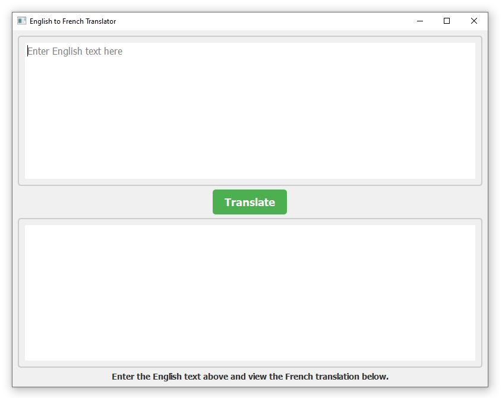
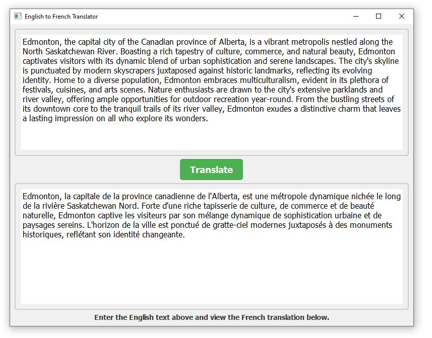

# English to French Translator

## Description:
This is a simple English-to-French translator application built using PyQt5 and the Hugging Face Transformers library. It allows users to input English text and receive the corresponding French translation.

## Requirements:
- Python (version 3.11.5)
- PyQt5 (version 5.15.10)
- transformers (version 4.35.2)
- sacremoses (version 0.1.1)

## Screenshots:

  
  

## Usage:
1. **Input English Text**: Enter the English text you want to translate into the provided text area.
2. **Translate**: Click the "Translate" button to initiate the translation process.
3. **View Translation**: The translated French text will appear in the output text area below.

## Notes:
- If translation fails, an error message will be displayed.
- Ensure an internet connection for model loading and translation.

Enjoy translating!
