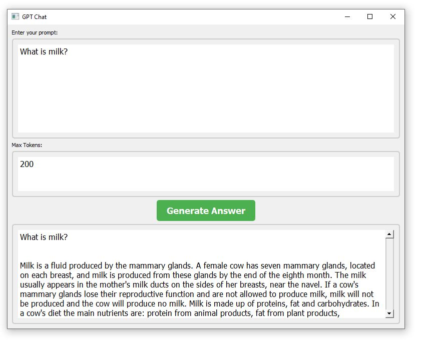
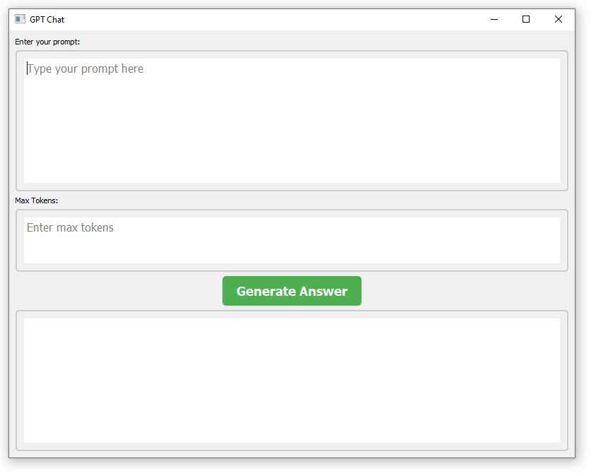

# GPT Chat README

## Overview
GPT Chat is a chatbot application that utilizes the GPT-2 XL pretrained model to generate responses to user prompts. It provides an offline chatbot experience that users can run on their local machines. Users can interact with the chatbot by entering prompts, and the application generates responses based on the input using the GPT-2 XL model.

## Screenshots:
<div>


</div>


## Requirements
To run the GPT Chat application, you need the following dependencies:
- Python 3.11.5
- transformers 4.35.2
- sacremoses 0.1.1
- PyQt5 5.15.10

## Installation
1. Install Python 3.11.5 on your local machine.
2. Install the required Python packages using pip:
    ```
pip install -r requirements.txt
    ```
## Usage
1. Clone or download the GPT model to your local machine.
2. Navigate to the directory containing the downloaded files.
3. Ensure that you have installed the required dependencies (see Installation section).
4. Run the following command to start the GPT Chat application
5. The application window will appear, allowing you to interact with the chatbot.
6. Enter your prompt in the provided input field and click the "Generate Answer" button to receive a response from the chatbot.
    ```
python Offline-Chatbot-Using-gpt2-xl-Model.py
    ```
## Features
- Enter prompts to initiate a conversation with the chatbot.
- Customize the maximum number of tokens for the generated response.
- View the generated response in the output text field.
- Offline usage: Run the chatbot locally on your machine without requiring an internet connection.

## Contributing
Contributions to the GPT Chat project are welcome! If you find any issues or have suggestions for improvements, please open an issue or submit a pull request on the GitHub repository.

## License
This project is licensed under the MIT License. See the LICENSE file for details.

## Acknowledgements
- The GPT Chat application utilizes the GPT-2 XL pretrained model from the Hugging Face Transformers library.
- PyQt5 is used for the graphical user interface of the application.
- MosesTokenizer and MosesDetokenizer from the sacremoses library are used for tokenization and detokenization.
- Special thanks to OpenAI for their work on the GPT models.


