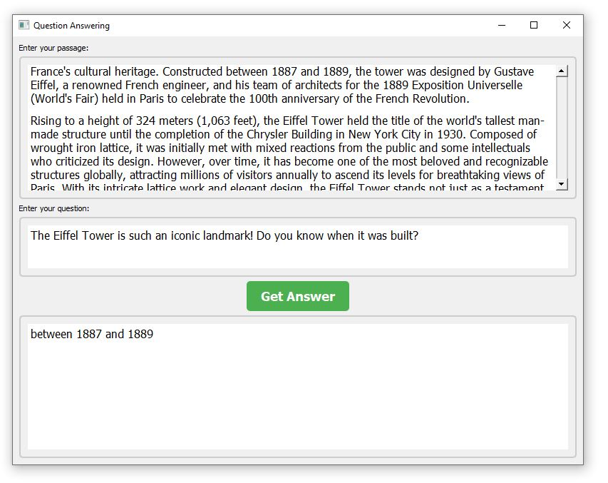
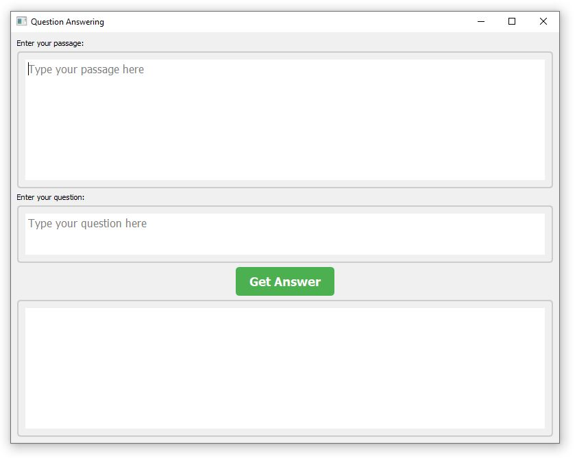

# Offline Question-Answering Application using BERT Pre-trained Model

## Overview
This application allows users to ask questions based on a provided passage using a pre-trained BERT (Bidirectional Encoder Representations from Transformers) model fine-tuned for question-answering tasks. Users can input both the passage and the question, and the application retrieves and displays the answer using the BERT model.


## Screenshots:
<div>


</div>


## Requirements
To run the GPT Chat application, you need the following dependencies:
- Python 3.11.5
- transformers 4.35.2
- sacremoses 0.1.1
- PyQt5 5.15.10

## Installation
1. Install Python 3.11.5 on your local machine.
2. Install the required Python packages using pip:

    ```
    pip install -r requirements.txt
    ```
    
## Usage
The application window will appear, allowing you to enter the passage and question.

-Enter the passage in the text area labeled "Enter your passage."
-Enter the question in the text area labeled "Enter your question."
-Click the "Get Answer" button to retrieve the answer based on the provided passage and question.
-The answer will be displayed in the text area below.

    ```
    python Offline-Chatbot-Using-gpt2-xl-Model.py
    ```

## Notes
-Ensure that both the passage and the question are provided before clicking the "Get Answer" button.

-In case of any errors during answer retrieval, an error message will be displayed in the answer output area.

## License
This project is licensed under the MIT License. See the LICENSE file for details.

## Acknowledgements
- This application utilizes the transformers library by Hugging Face for accessing the pre-trained BERT model.


