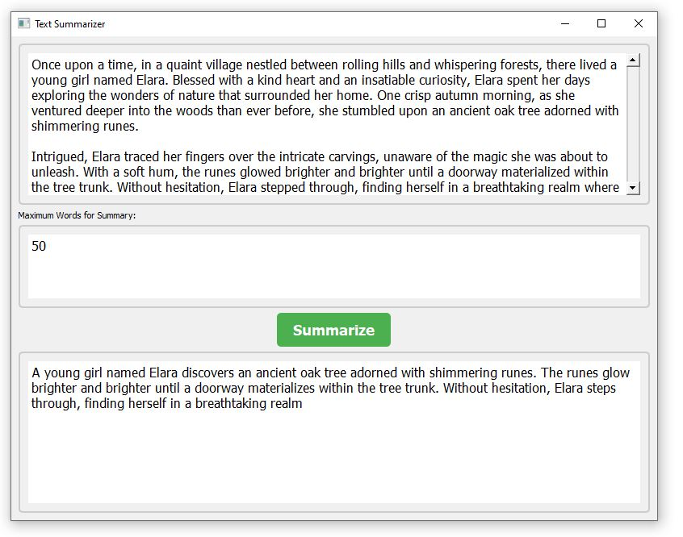
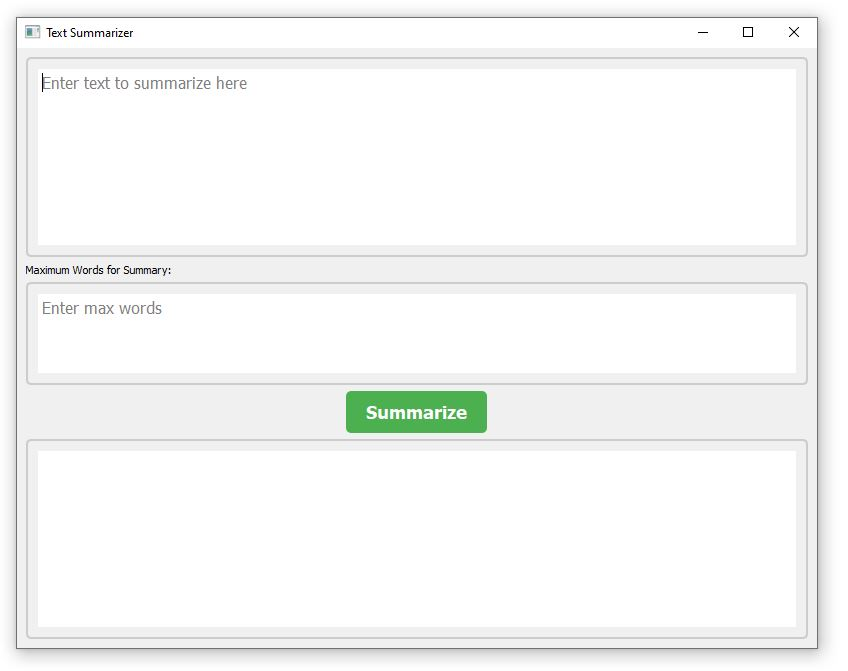

# Text Summarizer

This Python application provides a graphical user interface (GUI) for summarizing text using a pre-trained model from the Hugging Face Transformers library. It allows users to input text and specify the maximum number of words for the summary.

## Requirements:
- Python (version 3.6 or higher)
- PyQt5 (version 5.6 or higher)
- transformers (version 4.0 or higher)

## Installation:
1. Ensure you have Python installed on your system.
2. Install required Python packages:
    ```
    pip install PyQt5 transformers
    ```

## Usage:
1. Run the application by executing the script.
    ```
    python text_summarizer.py
    ```
2. Enter the text you want to summarize in the input text area.
3. Specify the maximum number of words for the summary.
4. Click the "Summarize" button to generate the summary.
5. View the generated summary in the output text area.

## Features:
- **Input Text Area**: Enter the text you want to summarize.
- **Maximum Words Input**: Specify the maximum number of words for the summary.
- **Summarize Button**: Initiate the text summarization process.
- **Output Text Area**: View the generated summary.

## Screenshots:
<div>
  
  
</div>

## Notes:
- Ensure an internet connection for model loading and text summarization.
- If the summarization process fails, an error message will be displayed in the output area.

Enjoy summarizing your text efficiently!
